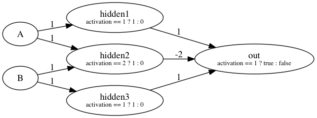

# scala_perceptron [](https://travis-ci.org/crazzle/scala_perceptron)
An asynchronous implementation of a perceptron in Scala to model different variations of multi layered neural networks.

The implementation gives the user the full flexibility from the definition of the activation function to wiring up each neuron
individually.

**To-Do**  
[X] Wire and model perceptrons setting wedge weights manually  
[X] Make result of the perceptron activation accessible using Trainer trait  
[X] Fix 700 neurons per layer limit by replacing merge of observables 
[-] Implement example of backpropagation for training  

To get a grasp what this means, here an example of a neural network to detect XOR on two inputs:

```scala
   /**
    * Inputs for the neural network
    */
   val inputA = WiringEdge(1)
   val inputB = WiringEdge(1)
   
   /**
    * Hidden Layer
    */
   val hidden1 = WiringEdge(1)
   Perceptron(Seq(inputA), hidden1, {case d => if(d == 1) 1d else 0d})
   
   val hidden2 = WiringEdge(-2)
   Perceptron(Seq(inputA, inputB), hidden2, {case d => if(d == 2) 1d else 0d})

   val hidden3 = WiringEdge(1)
   Perceptron(Seq(inputB), hidden3, {case d => if(d == 1) 1d else 0d})

   /**
    * Output Layer
    */
   val hiddenOutput = List[Edge](hidden1, hidden2, hidden3)
   val out = WiringEdge(1)
   Perceptron(hiddenOutput, out, (d: Double) => d)
   val res = Promise[Boolean]()
   out.listen {
     case (activation, weight) => res.success(activation == 0)
   }
```

The code above models the network described in the picture.




## MIT Licence
Copyright (c) 2016 Mark Keinhörster

Permission is hereby granted, free of charge, to any person obtaining a copy of this software and associated documentation files (the "Software"), to deal in the Software without restriction, including without limitation the rights to use, copy, modify, merge, publish, distribute, sublicense, and/or sell copies of the Software, and to permit persons to whom the Software is furnished to do so, subject to the following conditions:

The above copyright notice and this permission notice shall be included in all copies or substantial portions of the Software.

THE SOFTWARE IS PROVIDED "AS IS", WITHOUT WARRANTY OF ANY KIND, EXPRESS OR IMPLIED, INCLUDING BUT NOT LIMITED TO THE WARRANTIES OF MERCHANTABILITY, FITNESS FOR A PARTICULAR PURPOSE AND NONINFRINGEMENT. IN NO EVENT SHALL THE AUTHORS OR COPYRIGHT HOLDERS BE LIABLE FOR ANY CLAIM, DAMAGES OR OTHER LIABILITY, WHETHER IN AN ACTION OF CONTRACT, TORT OR OTHERWISE, ARISING FROM, OUT OF OR IN CONNECTION WITH THE SOFTWARE OR THE USE OR OTHER DEALINGS IN THE SOFTWARE.
